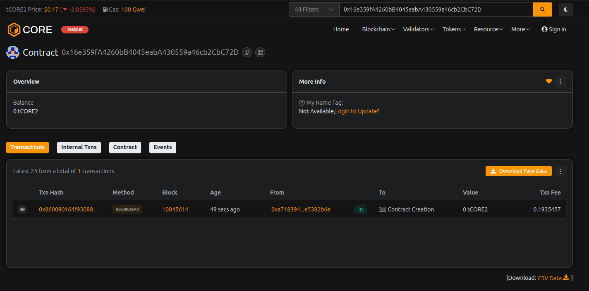

# FlowMint Pool

## Project Description

FlowMint Pool is a decentralized liquidity pool smart contract built on Ethereum that combines liquidity provision, staking mechanisms, and reward distribution. The protocol enables users to contribute liquidity to the pool, stake their assets to earn rewards, and participate in a transparent and secure DeFi ecosystem. The contract implements a time-weighted reward system that incentivizes long-term participation while maintaining flexibility for liquidity providers.

The FlowMint Pool contract leverages Solidity's security features and implements best practices to ensure safe handling of user funds. It provides a complete suite of functions for liquidity management, staking operations, reward calculations, and administrative controls.

## Project Vision

Our vision is to create a robust and user-friendly DeFi infrastructure that democratizes access to liquidity provision and yield generation. FlowMint Pool aims to:

- **Empower Users**: Enable anyone to become a liquidity provider and earn passive income through staking
- **Ensure Transparency**: All transactions and reward calculations are verifiable on-chain
- **Promote Sustainability**: Implement fair reward mechanisms that balance user incentives with protocol longevity
- **Foster Innovation**: Serve as a foundation for more complex DeFi products and financial instruments
- **Build Community**: Create a decentralized ecosystem where users collectively benefit from pool growth

We envision FlowMint Pool as a cornerstone protocol in the DeFi landscape, providing reliable infrastructure for decentralized liquidity management and reward distribution.

## Key Features

### 1. **Liquidity Management**
- Add liquidity to the pool and earn proportional rewards
- Remove liquidity with secure balance verification
- Real-time tracking of individual and total pool liquidity

### 2. **Staking Mechanism**
- Stake assets with configurable minimum stake amounts
- Time-locked staking to prevent gaming the reward system
- Flexible unstaking after minimum holding period

### 3. **Reward Distribution**
- Automated reward calculation based on stake duration and amount
- Time-weighted reward system for fair distribution
- Claim rewards at any time without unstaking

### 4. **Security Features**
- Owner-only administrative functions
- Active/inactive pool status control
- Minimum stake requirements to prevent dust attacks
- Comprehensive event logging for transparency

### 5. **Flexible Configuration**
- Adjustable reward rates by pool owner
- Configurable minimum stake amounts
- Pool status toggle for emergency situations

### 6. **Token Minting**
- Owner-controlled token minting capability
- Secure recipient validation
- Event tracking for all minting operations

### 7. **Comprehensive View Functions**
- Check pool balance, user liquidity, stakes, and rewards
- Calculate earned rewards in real-time
- Query reward per token metrics

### 8. **Gas Optimization**
- Efficient storage patterns
- Optimized reward calculation algorithms
- Minimal transaction overhead

### 9. **Event-Driven Architecture**
- Complete event emissions for all state changes
- Easy integration with front-end applications and analytics
- Transparent audit trail

### 10. **Fallback Handling**
- Accepts direct ETH transfers to pool
- Automatic liquidity tracking for received funds

## Future Scope

### Phase 1: Enhanced Features
- **Multi-Token Support**: Expand beyond ETH to support ERC-20 tokens
- **Tiered Rewards**: Implement reward multipliers based on stake duration
- **Governance Integration**: Add voting mechanisms for protocol parameters
- **NFT Rewards**: Issue NFTs to long-term stakers as proof of participation

### Phase 2: Advanced DeFi Integration
- **Yield Farming**: Enable users to farm additional tokens through liquidity provision
- **Flash Loan Support**: Integrate flash loan functionality for advanced traders
- **Cross-Chain Bridge**: Extend liquidity pools across multiple blockchain networks
- **Automated Market Maker (AMM)**: Implement swap functionality within the pool

### Phase 3: Risk Management
- **Insurance Pool**: Create a reserve fund to protect against smart contract vulnerabilities
- **Risk Scoring**: Implement AI-driven risk assessment for pool participants
- **Circuit Breakers**: Add automatic pause mechanisms during unusual market conditions
- **Audit Integration**: Regular third-party security audits and formal verification

### Phase 4: User Experience
- **Mobile App**: Develop native mobile applications for iOS and Android
- **Analytics Dashboard**: Comprehensive analytics for liquidity providers
- **Social Features**: Community forums and social trading capabilities
- **Educational Platform**: In-app tutorials and DeFi education resources

### Phase 5: Ecosystem Expansion
- **Developer SDK**: Release tools for third-party integrations
- **Partnership Program**: Collaborate with other DeFi protocols
- **Institutional Products**: Tailored solutions for institutional investors
- **Regulatory Compliance**: Adapt to evolving regulatory frameworks while maintaining decentralization

### Technical Roadmap
- Layer 2 scaling solutions integration (Optimism, Arbitrum)
- Zero-knowledge proof implementation for privacy features
- Decentralized oracle integration for price feeds
- Advanced tokenomics with burning and buyback mechanisms
- Delegation and proxy staking features
- Compound interest mechanisms for long-term stakers

---

## Deployment Guide

### Constructor Parameters

When deploying the FlowMintPool contract, you need to provide two parameters:

#### **_rewardRate** (uint256)
The reward rate determines how many wei are distributed per second per unit of total liquidity.

**Recommended Values:**

| Use Case | Value | Annual Yield | Description |
|----------|-------|--------------|-------------|
| Conservative | `5` | ~3-5% | Low risk, sustainable rewards |
| Moderate | `10` | ~8-12% | Balanced approach |
| Aggressive | `50` | ~15-25% | High yield, requires more reserves |
| Testing/Demo | `1000` | N/A | Fast rewards for testing |

#### **_minimumStake** (uint256)
The minimum amount of wei required to stake in the pool.

**Recommended Values:**

| Tier | Value (wei) | ETH Equivalent | USD Equivalent* | Use Case |
|------|-------------|----------------|-----------------|----------|
| Very Low | `1000000000000000` | 0.001 ETH | ~$3-4 | Testnet/Demo |
| Low | `10000000000000000` | 0.01 ETH | ~$30-40 | Inclusive participation |
| Medium | `100000000000000000` | 0.1 ETH | ~$300-400 | Standard deployment |
| High | `1000000000000000000` | 1 ETH | ~$3,000-4,000 | Serious investors |
| Very High | `10000000000000000000` | 10 ETH | ~$30,000-40,000 | Institutional |

*USD values are approximate and depend on current ETH market price

### Deployment Examples

#### For Testnet/Development:
```solidity
FlowMintPool pool = new FlowMintPool(1000, 1000000000000000);
// _rewardRate: 1000 (fast rewards for testing)
// _minimumStake: 0.001 ETH
```

#### For Mainnet - Conservative:
```solidity
FlowMintPool pool = new FlowMintPool(5, 100000000000000000);
// _rewardRate: 5 (moderate, sustainable rewards)
// _minimumStake: 0.1 ETH
```

#### For Mainnet - Balanced:
```solidity
FlowMintPool pool = new FlowMintPool(10, 10000000000000000);
// _rewardRate: 10 (good rewards)
// _minimumStake: 0.01 ETH (inclusive)
```

#### For Mainnet - Aggressive:
```solidity
FlowMintPool pool = new FlowMintPool(50, 100000000000000000);
// _rewardRate: 50 (high rewards)
// _minimumStake: 0.1 ETH
```

### Important Notes

- **1 ETH = 1,000,000,000,000,000,000 wei** (10^18)
- Reward calculation formula: `(stakedAmount × rewardRate × timeInSeconds) / totalLiquidity`
- Higher reward rates require more pool reserves to sustain payouts
- Lower minimum stakes increase accessibility but may result in higher gas costs
- Always test on testnet before mainnet deployment
- Ensure the contract is funded with sufficient ETH to cover rewards

### Recommended Configuration by Network

| Network | Reward Rate | Minimum Stake | Rationale |
|---------|-------------|---------------|-----------|
| **Ethereum Mainnet** | `5-10` | `0.1 ETH` | High security, moderate participation |
| **Polygon** | `20-50` | `10 MATIC` | Lower costs, higher engagement |
| **BSC** | `15-30` | `0.1 BNB` | Balanced approach |
| **Arbitrum/Optimism** | `10-25` | `0.05 ETH` | L2 efficiency benefits |
| **Testnets** | `1000+` | `0.001 ETH` | Fast testing, low barriers |

---

## Contract Details:

Transaction id: 0x16e359fA4260bB4045eabA430559a46cb2CbC72D
